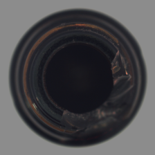
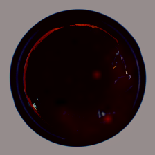
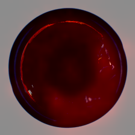
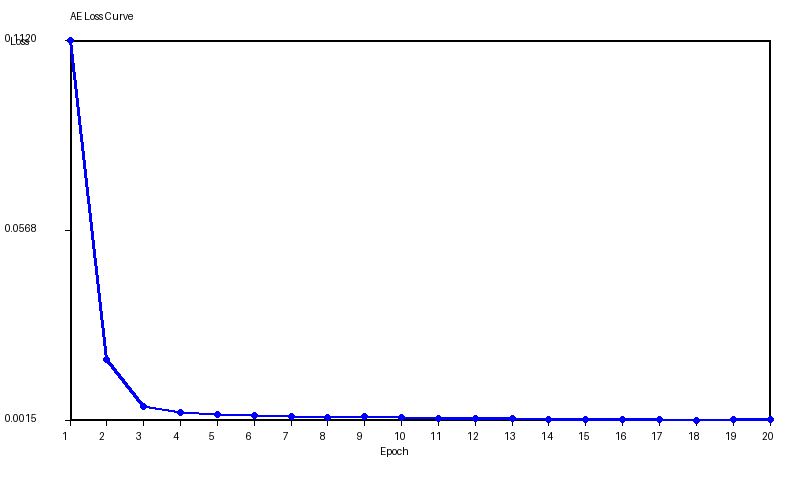

# MVTec Anomaly Detection

CPU-only environment에서 MVTec AD 데이터셋으로 이상 탐지 모델을 구현하고 비교하는 프로젝트입니다.  
현재 파이프라인은 `AE`, `PaDiM`, `PatchCore`를 동일한 평가 기준으로 실행하고, AUROC와 추론 효율을 함께 분석합니다.

## Highlights

- 공통 벤치마크 엔트리포인트: [`src/benchmark.py`](/c:/Users/sunde/Documents/projects/mvtec-anomaly-detection/src/benchmark.py)
- 지원 모델: AutoEncoder, PaDiM, PatchCore
- 평가 지표: image AUROC, pixel AUROC, preparation time, ms/image
- 추가 분석: scenario score, grouped score, seed aggregation, sensitivity summary
- 시각화 결과: anomaly map overlay, AE loss curve

## Methods

- `AE`
  정상 이미지만으로 학습하는 reconstruction baseline입니다.
- `PaDiM`
  pretrained ResNet feature에 대해 위치별 Gaussian 분포를 모델링하고 Mahalanobis distance로 이상도를 계산합니다.
- `PatchCore`
  정상 patch feature memory bank를 구성하고 kNN distance 기반으로 anomaly score를 계산합니다.

PaDiM과 PatchCore는 같은 ResNet backbone을 사용하고, AE는 별도 encoder-decoder를 사용합니다.

## Dataset

이 저장소에는 데이터셋이 포함되어 있지 않습니다. 아래 구조로 MVTec AD를 배치하면 됩니다.

```text
data/mvtec_ad/
  bottle/
    train/good/*.png
    test/good/*.png
    test/broken_large/*.png
    ground_truth/broken_large/*_mask.png
  capsule/
  cable/
  carpet/
  grid/
  hazelnut/
  leather/
  metal_nut/
  pill/
  screw/
  tile/
  toothbrush/
  transistor/
  wood/
  zipper/
```

## Environment

- Python 3.11
- PyTorch
- torchvision
- scikit-learn
- Pillow

```bash
pip install -r requirements.txt
```

## Run

전체 카테고리 실행 예시:

```bash
python -m src.benchmark --root data/mvtec_ad --category all --device cpu --out outputs
```

여러 seed를 함께 실행하는 예시:

```bash
python -m src.benchmark --root data/mvtec_ad --category bottle,cable,capsule,screw --seeds 0,1,2 --device cpu --out outputs
```

## Output Structure

기본 시각화 결과:

```text
outputs/<category>/
  ae/
  padim/
  patchcore/
```

최신 벤치마크 러닝 결과:

```text
outputs/results/run_<timestamp>/
  raw_metrics.csv
  scenario_scores.csv
  scenario_scores_summary.csv
  scenario_winners_by_category.csv
  scenario_winners_overall.csv
  grouped_scores_by_alignment.csv
  grouped_scores_by_defect_extent.csv
  grouped_scores_2x2.csv
  sensitivity_scores.csv
  sensitivity_summary.csv
  seed_runs.csv
  seed_aggregated_summary.csv
  visuals/
  AE_epoch_test/
```

생성 이미지 종류:

- `*_img.png`: input image
- `*_gt.png`: ground-truth mask
- `*_map.png`: anomaly heatmap
- `*_overlay.png`: image + heatmap overlay
- `ae_loss_curve.png`: AE training loss curve

## Example Results

Bottle 카테고리의 동일 샘플에 대한 오버레이 예시입니다.

| AE | PaDiM | PatchCore |
| --- | --- | --- |
|  |  |  |

AE 학습 loss curve 예시:



## Snapshot

`outputs/results/run_2026-03-27_15-51-40` 기준 요약:

- `S_perf`, `S_bal` winner는 대부분 `PaDiM`
- `S_eff`는 일부 카테고리에서 `AE`가 우세
- `overall_model` 기준 평균 성능은 `PaDiM`이 가장 안정적

## Evaluation Metrics

- `Image AUROC`
  이미지별 단일 anomaly score를 기준으로 계산합니다.
- `Pixel AUROC`
  heatmap과 GT mask를 이용해 픽셀 단위로 계산합니다.
- `S_perf`
  성능 중심 점수입니다.
- `S_bal`
  성능과 효율의 균형 점수입니다.
- `S_eff`
  효율 중심 점수입니다.

정규화, 시나리오 스코어, seed 집계 로직은 [`src/utils/scoring.py`](/c:/Users/sunde/Documents/projects/mvtec-anomaly-detection/src/utils/scoring.py) 에 정리되어 있습니다.
